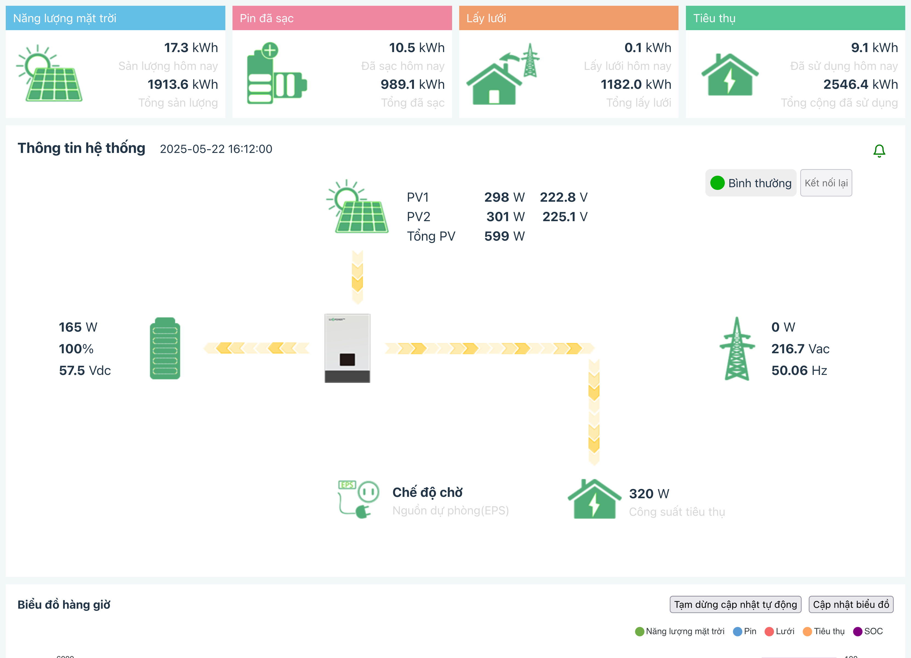

# Lux Grid Watcher

[Tiếng Việt](README-vi.md) | [English](README.md)

      

## Giới thiệu
Một script Python cho phép giám sát biến tần Luxpower SNA theo thời gian thực. Đã thử nghiệm trên Luxpower SNA 6K với kết nối wifi loại cũ (tên wifi dạng BAxxxxxx)

## Cấu hình
* Sao chép `.env.example` thành `.env`
* Cập nhật thông tin cấu hình trong tập tin `.env` với thông tin của bạn

## Cài đặt và chạy
* Đồng bộ git submodule với `git submodule init && git submodule update`
* Yêu cầu Python 3
* Tạo môi trường ảo Python với `python -m venv venv`
* Kích hoạt môi trường ảo Python bằng `source venv/Scripts/activate` trên Windows dùng git-bash hoặc `source venv/bin/active` trên Unix/Linux
* Cài đặt các thư viện phụ thuộc với `pip install -r requirements.txt` hoặc `./pip-binary-install.sh`
* Chạy ứng dụng với `python app.py`
> Nếu bạn không thể cài đặt và chạy ứng dụng, bạn có thể sử dụng phương pháp chạy bằng docker bên dưới

## Muốn dùng docker? Đây là các bước
* Di chuyển vào thư mục `docker`
* Chạy lệnh `docker compose up -d` để chạy container docker

## Ứng dụng thông báo
Bạn có thể tự xây dựng ứng dụng thông báo cho Android/iOS và cho Firebase Device ID vào tập tin `devices.json` để nhận thông báo khi trạng thái kết nối lưới điện thay đổi.

Tôi cũng đã phát triển một ứng dụng cho Android/iOS. Nếu bạn cần, cứ thoải mái liên hệ với tôi.

## Trình xem web
* Biên dịch giao diện với lệnh `cd web_viewer/fe_src && yarn install && yarn build` (Bỏ qua bước này nếu bạn chạy bằng docker)
* Bây giờ bạn có thể xem giao diện web LuxPower theo thời gian thực tại http://localhost:88, giao diện sẽ tương tự như hình ảnh bên dưới (URL này có thể thay đổi bằng cách chỉnh sửa biến `PORT` trong tập tin `.env`)

<picture style="max-width: 800px">
    <source srcset="misc/screenshot-light-vi.png" media="(prefers-color-scheme: light)"/>
    <source srcset="misc/screenshot-dark-vi.png"  media="(prefers-color-scheme: dark)"/>
    
</picture>

## Bên thứ ba

Cảm ơn [@celsworth](https://github.com/celsworth) với dự án tuyệt vời [celsworth/lxp-packet](https://github.com/celsworth/lxp-packet) *(đã bị xoá)* và [celsworth/lxp-bridge](https://github.com/celsworth/lxp-bridge) (theo giấy phép MIT)
