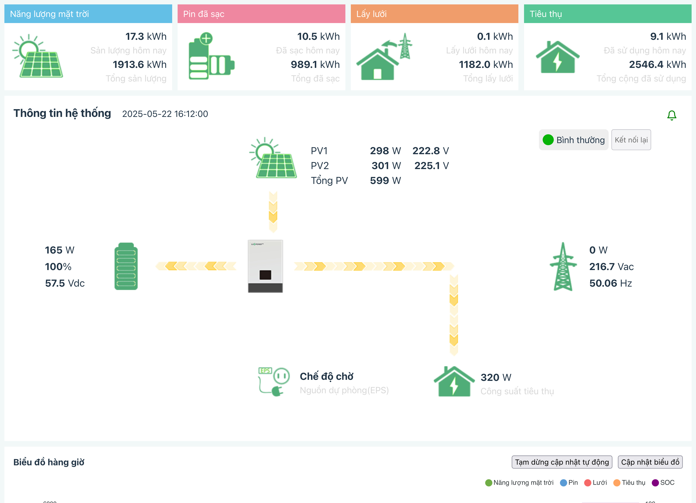

# Lux Viewer

Tiếng Việt | [English](README.md)

   

   

## Giới thiệu

    

Một script Python cho phép giám sát biến tần Luxpower SNA theo thời gian thực. Đã thử nghiệm trên Luxpower SNA 6K với kết nối wifi loại cũ (tên wifi dạng BAxxxxxx)

## Thiết lập biến tần
Xem hướng dẫn trên wiki của `lxp-bridge` [tại đây](https://github.com/celsworth/lxp-bridge/wiki/Inverter-Setup). _(Bạn có thể bỏ qua phần thiết lập sạc AC)_

## Cấu hình
* Sao chép `.env.example` thành `.env`
* Cập nhật thông tin cấu hình trong tập tin `.env` với thông tin của bạn

### Chế độ ReadInput (DONGLE/SERVER)
Bạn có thể chọn loại frame input cần đọc bằng biến `READ_INPUT_MODE` trong `.env`:

* `READ_INPUT_MODE=INPUT1_ONLY`: chỉ đọc ReadInput1 (register `0`, count `40`)
* `READ_INPUT_MODE=INPUT1_ONLY`: đọc tuần tự ReadInput1 -> ReadInput4 (register `0`, `40`, `80`, `120`)

`ALL` cho dữ liệu đầy đủ hơn bằng cách gộp ReadInput1-4, còn `INPUT1_ONLY` có payload nhỏ hơn.

## Cài đặt và chạy
* Đồng bộ git submodule với `git submodule init && git submodule update`
* Yêu cầu Python 3
* Tạo môi trường ảo Python với `python -m venv venv`
* Kích hoạt môi trường ảo Python bằng `source venv/Scripts/activate` trên Windows dùng git-bash hoặc `source venv/bin/active` trên Unix/Linux
* Cài đặt các thư viện phụ thuộc với `pip install -r requirements.txt` hoặc `./pip-binary-install.sh` trên thiết bị cấu hình yếu (ví dụ: bộ định tuyến OpenWrt)
* Chạy ứng dụng với `python app.py`
> Nếu bạn không thể cài đặt và chạy ứng dụng, bạn có thể sử dụng phương pháp chạy bằng docker bên dưới

## Muốn dùng docker? Đây là các bước
* Di chuyển vào thư mục `docker`
* Chạy lệnh `docker compose up -d` để chạy container docker

## Ứng dụng di động
Bạn có thể tự xây dựng ứng dụng thông báo cho Android/iOS và gửi Firebase device token vào tập tin `devices.json` để nhận thông báo mỗi khi trạng thái kết nối lưới điện thay đổi.

Tác giả cũng phát triển một ứng dụng **Lux App Viewer (Android/iOS)**. Nếu bạn cần, hãy liên hệ để nhận hỗ trợ.

Web server tích hợp cung cấp các API thân thiện với thiết bị di động:
* `POST /fcm/register` với JSON (hoặc form body) `token=<firebase_device_token>` để đăng ký token thiết bị
* `GET /mobile/state` để lấy trạng thái kết nối lưới hiện tại và lịch sử thay đổi

## Trình xem web
* Biên dịch giao diện với lệnh `cd web_viewer/fe_src && yarn install && yarn build` (Bỏ qua bước này nếu bạn chạy bằng docker)
* Bây giờ bạn có thể xem giao diện web LuxPower theo thời gian thực tại http://localhost:88 (hoặc ở cổng khác nếu bạn thay đổi `PORT` trong `.env`).
* HTTPS cũng được hỗ trợ; bật bằng cách đặt `HTTPS_ENABLED=true` và cung cấp `HTTPS_PORT`, `HTTPS_CERT_FILE`, `HTTPS_KEY_FILE` trong `.env`.

<picture style="max-width: 800px">
    <source srcset="misc/screenshot-light-vi.png" media="(prefers-color-scheme: light)"/>
    <source srcset="misc/screenshot-dark-vi.png"  media="(prefers-color-scheme: dark)"/>
    
</picture>

## Giấy phép

Dự án này được phát hành theo giấy phép MIT. Xem chi tiết trong tập tin [LICENSE](LICENSE).

## Bên thứ ba

Cảm ơn [@celsworth](https://github.com/celsworth) với dự án tuyệt vời [celsworth/lxp-packet](https://github.com/celsworth/lxp-packet) *(đã bị xoá)* và [celsworth/lxp-bridge](https://github.com/celsworth/lxp-bridge) (theo giấy phép MIT)

Dự án này có chứa mã nguồn từ thư viện `aiohttp` (https://github.com/aio-libs/aiohttp.git) được phát hành dưới giấy phép Apache License 2.0.