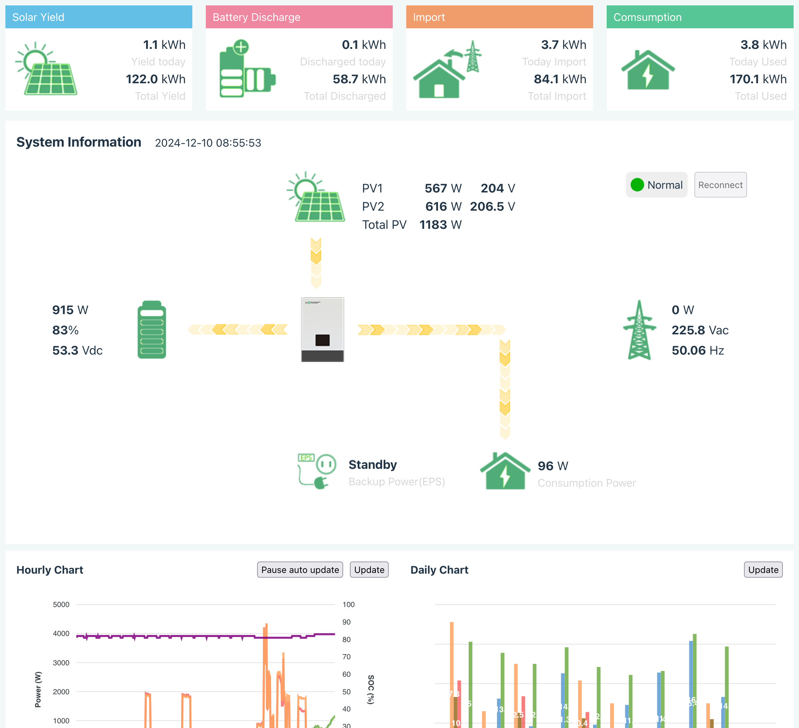

# Lux Grid Watcher

[Tiếng Việt](README-vi.md) | [English](README.md)

  
   

## About
A python script allow watch Luxpower SNA inverter in realtime. Tested in Luxpower SNA 6K with old wifi dongle (BAxxxxxx wifi name)

## Configuration
* Copy `.env.example` to `.env`
* Update configuration in `.env` with your info

## Installation and run
* Sync gitsubmodule with `git submodule init && git submodule update`
* Python 3 required
* Setup python venv with `python -m venv venv`
* Active python venv `source venv/Scripts/activate` on git-bash Windows or `source venv/bin/active` on Unix/Linux
* Install dependencies with `pip install -r requirements.txt` or `./pip-binary-install.sh`
* Run application with `python app.py`
> If you can't install and run you can use docker method bellow

## Locking for docker? Here is step
* cd to `docker` folder
* run command `docker compose up -d` to run docker container

## Notification app
You can implement notification app for Android/iOS by your self and push Firebase Device ID to devices.json file to get notification when grid connect state change.

I also developed an app for Android/iOS. If you need it feel free to contact me

## Web Viewer
* Build FE with command `cd web_viewer/fe_src && yarn install && yarn build` (Ignore this step if you runing via docker)
* Now you can see LuxPower realtime web viewer in http://locahost:88, UI layout will be similar with the image bellow (This url can be change by modify `PORT` variable in `.env` file)

<picture style="max-width: 800px">
    <source srcset="misc/screenshot-light.png" media="(prefers-color-scheme: light)"/>
    <source srcset="misc/screenshot-dark.png"  media="(prefers-color-scheme: dark)"/>
    
</picture>

## Third-party

Thanks to [@celsworth](https://github.com/celsworth) by awesome project [celsworth/lxp-packet](https://github.com/celsworth/lxp-packet) *(has been deleted)* and [celsworth/lxp-bridge](https://github.com/celsworth/lxp-bridge) (under MIT License)
