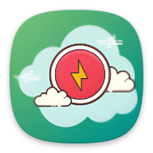
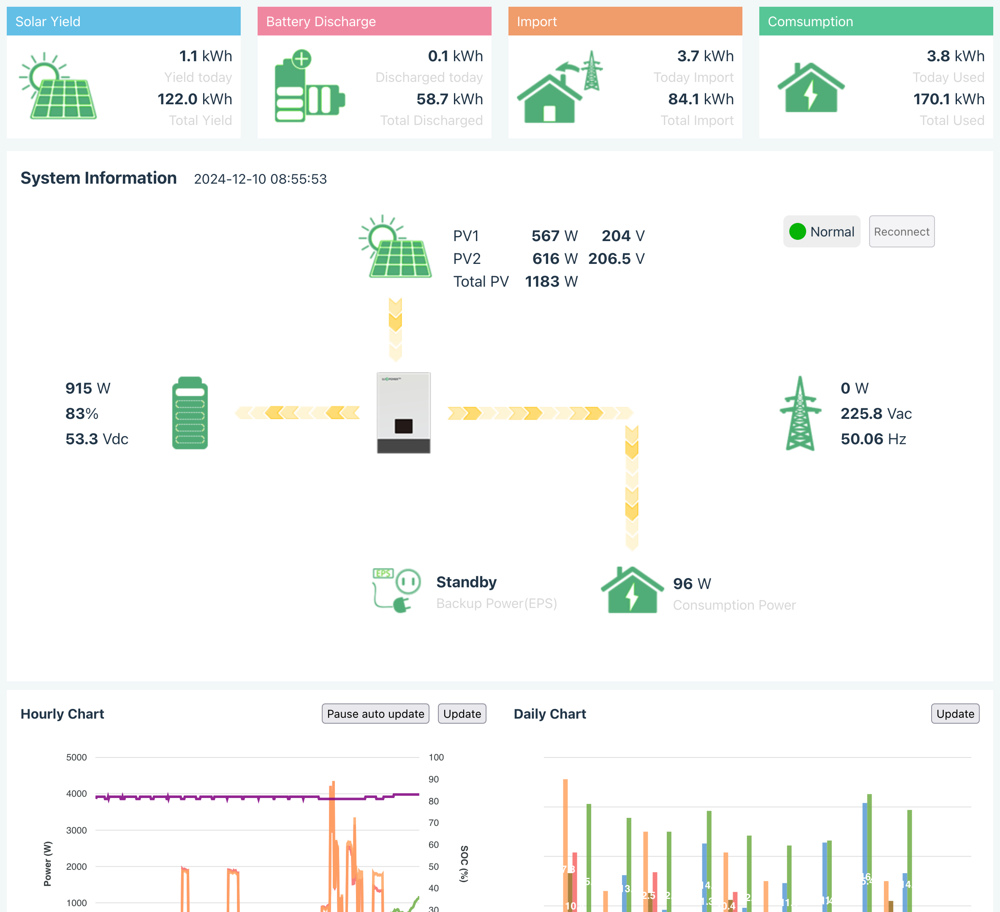

# Lux Web Viewer

[Tiếng Việt](README-vi.md) | English

   

   

## About

    

A python script allow watch Luxpower SNA inverter in realtime. Tested in Luxpower SNA 6K with old wifi dongle (BAxxxxxx wifi name)

## Inverter setup
See wiki from `lxp-bridge` [here](https://github.com/celsworth/lxp-bridge/wiki/Inverter-Setup). _(You can ignore AC charge setup)_

## Configuration
* Copy `.env.example` to `.env`
* Update configuration in `.env` with your info

### ReadInput Mode (DONGLE/SERVER)
You can control which inverter input frame is requested by setting `READ_INPUT_MODE` in `.env`:

* `READ_INPUT_MODE=INPUT1` (aliases: `INPUT1`, `READINPUT1`, `READ_INPUT1`): request only ReadInput1 (register `0`, count `40`)
* `READ_INPUT_MODE=ALL` : request ReadInput1 -> ReadInput4 sequentially (registers `0`, `40`, `80`, `120`)

`ALL` provides the most complete data set by combining ReadInput1-4, while `INPUT1` uses smaller payloads.

## Installation and run
* Sync gitsubmodule with `git submodule init && git submodule update`
* Python 3 required
* Setup python venv with `python -m venv venv`
* Active python venv `source venv/Scripts/activate` on git-bash Windows or `source venv/bin/active` on Unix/Linux
* Install dependencies with `pip install -r requirements.txt` or `./pip-binary-install.sh` on low-end device (example: OpenWrt router)
* Run application with `python app.py`
> If you can't install and run you can use docker method bellow

## Locking for docker? Here is step
* cd to `docker` folder
* run command `docker compose up -d` to run docker container

## Mobile Application
You can implement your own notification app for Android/iOS and save tokens to `devices.json` to receive push alerts when grid connection state changes.

The author also provides a **Lux App Viewer (Android/iOS)**. If you need it, feel free to contact for more support.

The built-in web server exposes mobile-friendly APIs:
* `POST /fcm/register` with JSON (or form body) `token=<firebase_device_token>` to register a device token
* `GET /mobile/state` to read current grid connection state and state-change history

## Web Viewer
* Build FE with command `cd web_viewer/fe_src && yarn install && yarn build` (Ignore this step if you run via docker)
* Now you can see LuxPower realtime web viewer in http://localhost:88 (or another port if you changed `PORT` in `.env`).
* HTTPS is also supported; enable it by setting `HTTPS_ENABLED=true` and providing `HTTPS_PORT`, `HTTPS_CERT_FILE`, and `HTTPS_KEY_FILE` in `.env`.

<picture style="max-width: 800px">
    <source srcset="misc/screenshot-light.png" media="(prefers-color-scheme: light)"/>
    <source srcset="misc/screenshot-dark.png"  media="(prefers-color-scheme: dark)"/>
    
</picture>

## License

This project is licensed under the MIT License. See the [LICENSE](LICENSE) file for details.

## Third-party

Thanks to [@celsworth](https://github.com/celsworth) by awesome project [celsworth/lxp-packet](https://github.com/celsworth/lxp-packet) *(has been deleted)* and [celsworth/lxp-bridge](https://github.com/celsworth/lxp-bridge) (under MIT License)

This project includes code from `aiohttp` library (https://github.com/aio-libs/aiohttp.git) which is licensed under the Apache License 2.0.